## 欢迎加入社区交流群

*群已满员，请添加 mjw707577045 加群*

 

## [工具在线链接](http://blog.luckly-mjw.cn/tool-show/iconfont-preview/index.html)

## 功能简介
- iconfont web 在线预览工具，无需安装，打开即用。
- 可预览本地 ttf 文件中定义的所有 icon。
- 也支持预览 [阿里iconfont](https://www.iconfont.cn) 中的三种模式，unicode，Font class，Symbol。根据在线字体链接即可解析预览其定义的所有icon。


## 需求背景
*本工具用于解决以下问题*
- 接手二手项目时，不清楚项目中定义了哪些 icon。
  - 接手二手项目，有时由于交接不到位，只能找到引用的 css。但不清楚该 icon 库具体包含哪些 icon。
  - 导致二次开发时，不能很好地复用之前的 icon，若引入新icon，可能还会重复定义。导致前后 icon 风格不统一。
- 使用外部样式库，成套的后台管理系统框架时。找到其 icon 的定义列表比较麻烦。
  - 需要先找到对应的官网，再找到其对 icon 定义。整个过程较为繁琐。而且还不一定有介绍。
- 故笔者开发了这个 iconfont 在线预览工具，无需安装，打开web页面即可预览 icon 库。

## 🚀 本地字体扫描（推荐）

**font-searcher.js** 是一个强大的 Node.js 脚本，可以快速扫描本地项目中的字体文件，并在浏览器中直接预览，无需手动上传文件。

### 为什么使用 font-searcher？

| 传统方式 | font-searcher 方式 |
|---------|-------------------|
| 手动查找项目中的字体文件 | ✅ 自动递归扫描整个项目目录 |
| 逐个上传文件到网页预览 | ✅ 一键启动，自动打开浏览器预览 |
| 切换字体需要重复上传 | ✅ 扫描结果直接列出，点击即可切换 |
| 不支持 woff2 等格式上传 | ✅ 支持 .ttf .woff .woff2 .otf .eot 所有格式 |

### 使用方式

**1. 下载脚本**

在网页右下角点击「📦 Node 扫描脚本」按钮直接下载，或从仓库中获取 `font-searcher.js`。

**2. 运行脚本**

```bash
# 扫描当前目录
node font-searcher.js

# 扫描指定目录
node font-searcher.js -p ./src/assets/fonts

# 扫描绝对路径
node font-searcher.js -p "D:\projects\my-app\fonts"

# 查看帮助
node font-searcher.js -h
```

**3. 自动打开浏览器**

脚本启动后会自动：
- 扫描指定目录下的所有字体文件（递归，自动跳过 node_modules 等目录）
- 启动本地 HTTP 服务器（端口 3456）
- 自动打开浏览器预览页面

**4. 在网页中选择字体**

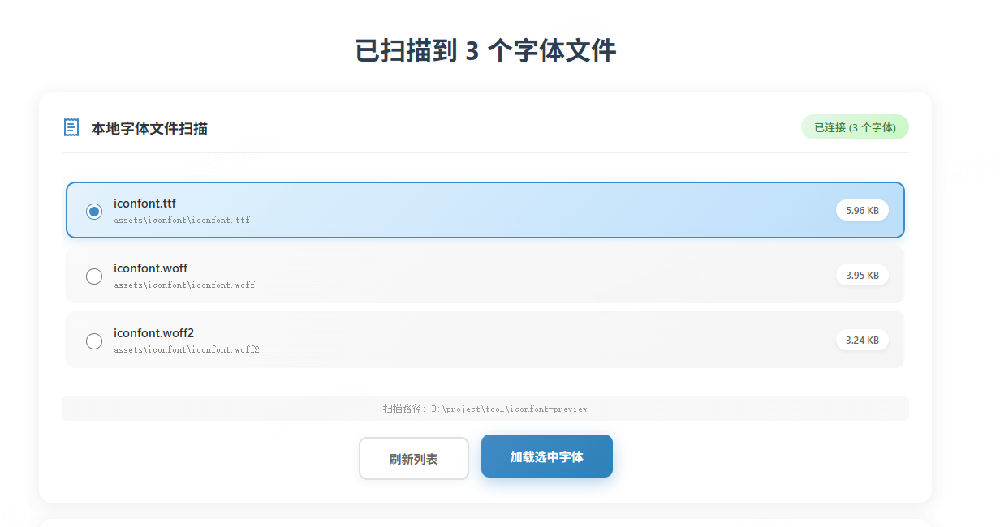

网页会显示扫描到的所有字体文件列表，包括：
- 文件名和相对路径
- 文件大小
- 支持的格式类型

选择任意字体文件后点击「加载选中字体」即可预览该字体中的所有图标。

### 命令行参数

| 参数 | 说明 | 示例 |
|------|------|------|
| `-p, --path` | 指定扫描目录路径 | `-p ./fonts` |
| `-h, --help` | 显示帮助信息 | `-h` |

### API 接口

脚本启动后提供以下 HTTP API：

| 接口 | 说明 |
|------|------|
| `/api/fonts` | 获取字体文件列表 |
| `/api/font?path=xxx` | 获取指定字体文件内容 |
| `/api/health` | 健康检查 |

---

## 使用教程

### 使用本地文件（传统方式）
- 点击按钮
 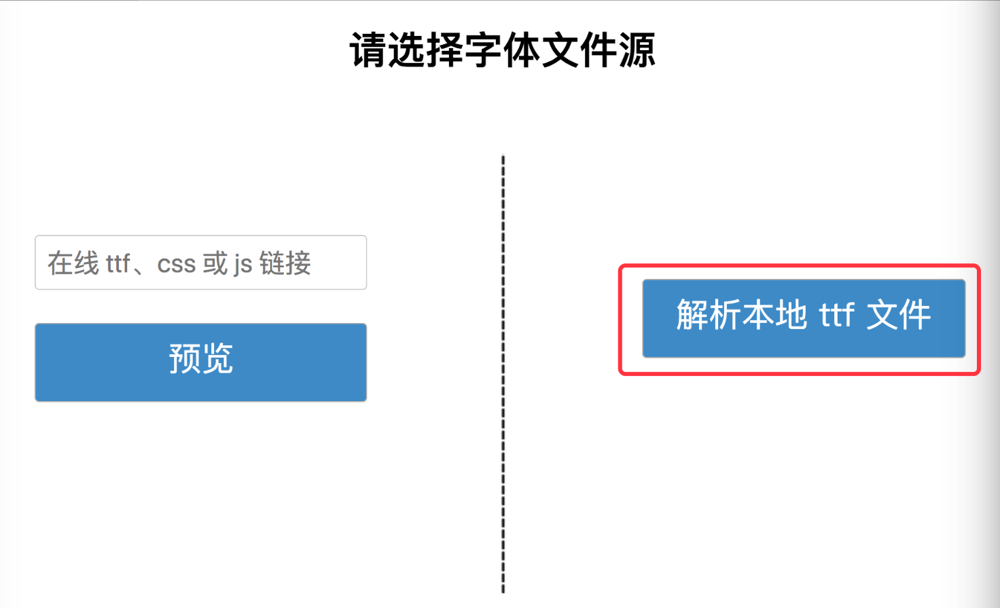

- 选择 ttf 后缀文件
 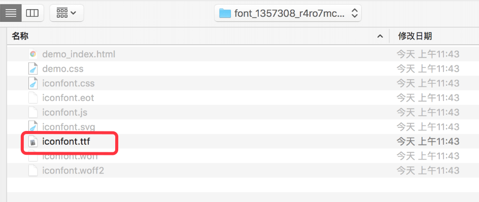

- 解析成功
 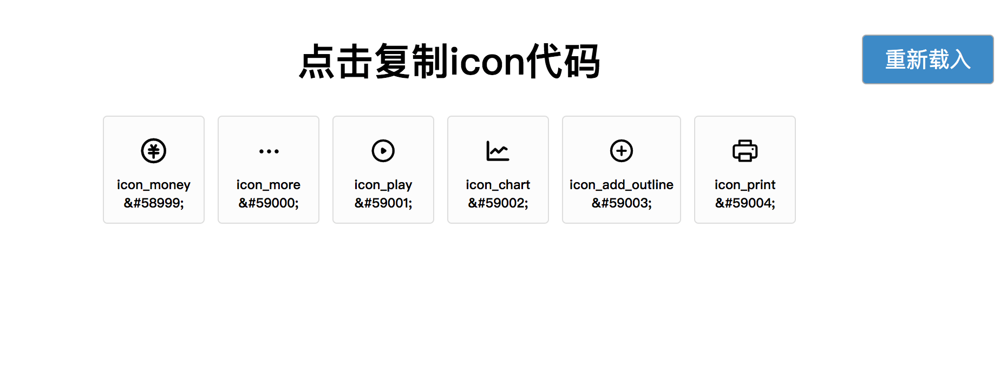

- 点击具体图标，可复制该 icon 代码
 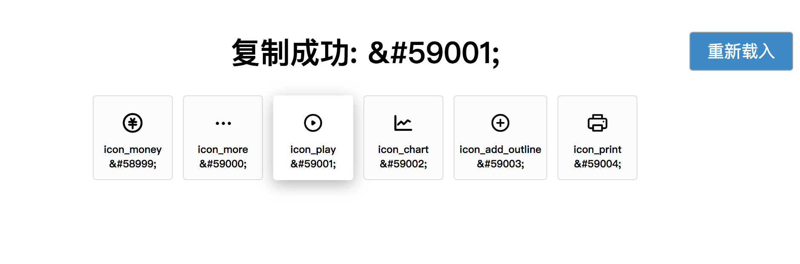

### 解析在线文件（针对阿里图标库）
- 复制在线资源链接
 - 针对 unicode 模式，复制在线 ttf 文件链接
  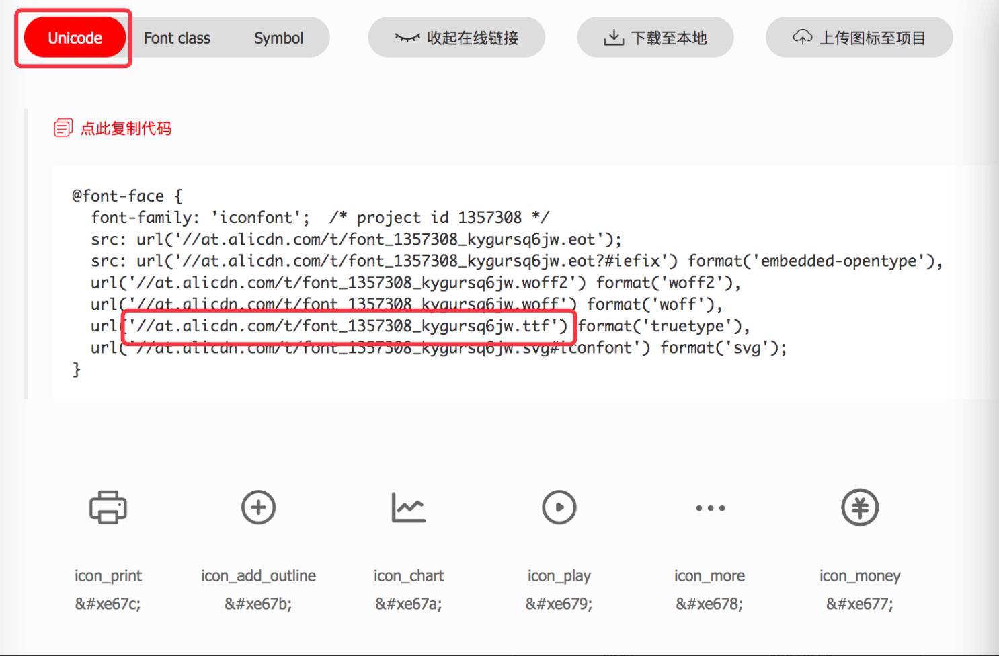

 - 针对 Font class 模式，复制在线 css 文件链接
  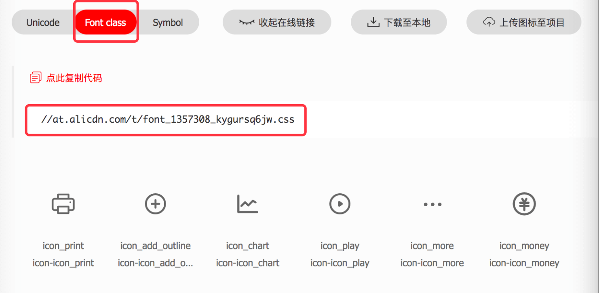

 - 针对 Symbol  模式，复制在线 js 文件链接
  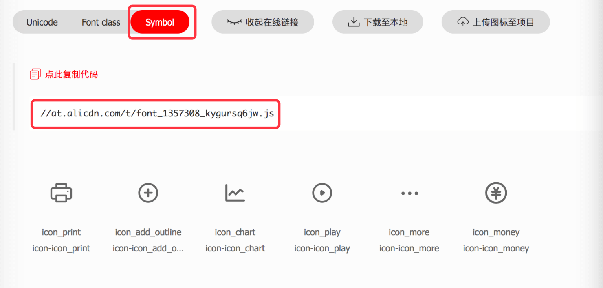
  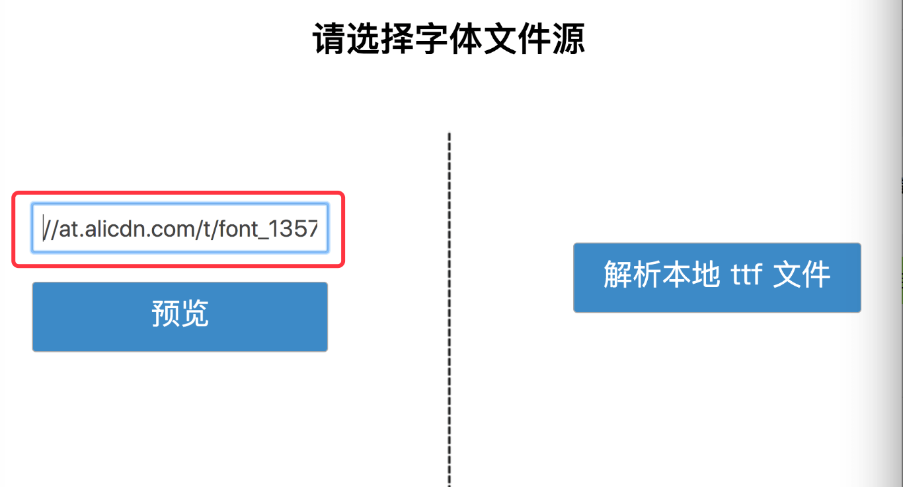

- 点击解析
 

- 解析成功，点击具体图标，可复制该 icon 代码
 


## iconfont相关知识
*之前一直只知道怎么用 iconfont ，但并没有深入了解相关知识，最新学习了一下，在这里跟大家分享。*

### 阿里图标三种模式
- unicode 模式
 - 它本身和引用外部自定义字体没有区别。只是一个表现出来是图形，另一个是文字。对系统来说，没有区别。
 - 引用 iconfont 和引用自定义字体，使用的代码是一样
   - 定义字体族

      ```
      @font-face {
          font-family: 'iconfont';  /* 自定义字体族名，可以是任意名， */
          src: url('//at.alicdn.com/t/font_1357308_kygursq6jw.eot'); /* 字体描述文件链接 */
          src: url('//at.alicdn.com/t/font_1357308_kygursq6jw.eot?#iefix') format('embedded-opentype'), /* 兼容 IE9 */
          url('//at.alicdn.com/t/font_1357308_kygursq6jw.woff2') format('woff2'), /* 兼容 IE6-IE8 */
          url('//at.alicdn.com/t/font_1357308_kygursq6jw.woff') format('woff'), /* 兼容 chrome, firefox, opera, Safari, Android, iOS 4.2+ */
          url('//at.alicdn.com/t/font_1357308_kygursq6jw.ttf') format('truetype'), /* 兼容 chrome, firefox, opera, Safari, Android, iOS 4.2+ */
          url('//at.alicdn.com/t/font_1357308_kygursq6jw.svg#iconfont') format('svg'); /* 兼容 iOS 4.1及以上 */
      }
      ```

  - 使用字体族（无论是文本还是icon）

    ```
    .iconfont {
        font-family: "iconfont" !important; /*使用自定义字体或者icon*/
        /* 上面一句，和我们平时定义「微软雅黑」（font-family: "Microsoft YaHei", sans-serif;）字体是同样的语法 */
        /* 只是「微软雅黑」在大部分电脑都会自带有，浏览器能直接找到系统的「微软雅黑」字体描述文件，不需要我们自己定义字体族，不需要使用外部的字体描述文件 */
    }
    ```


  - 「&#」的意思，「&#」 开头的是HTML实体。所有 html 显示的内容，都可以通过 &# 的形式表述。例如，汉字的HTML实体由三部分组成，```&#(中午对应ASCII);```。例如，把“最新” 转换成“&#26368;&#26032;”
  - 为什么中英文能直接显示，不需要使用「&#」形式表示呢？因为中英文有 ASCII 进行自动转义。而 iconfont 不在 ASCII 中定义。是自定义的。
  - iconfont 相当使用了剩余的 unicode 编码，将自定义的图标描述通过 &# 开头的 HTML 实体的形式表现出来。
  - 以「&#」开头的后接十进制数字，以「&#x」开头的后接十六进制数字

- Font class
  - 该模式和 unicode 模式是同样的原理，通过 unicode 编码保存。只是使用方式不同。
  - unicode 是直接将内容写到 innerHTML 中转义，而 font class 则是通过 css 的 :before 伪类，将通过 content 来定义。
  - 在 font class 中，「&#x」被转义符「\」替换，因为「&#x」是 html 实体字符，只会被 html 解析，不能在 css 中被解析。
  - 通过阿里iconfont 给出的 css 链接，在浏览器中直接查看该文件可以看到其定义

    
    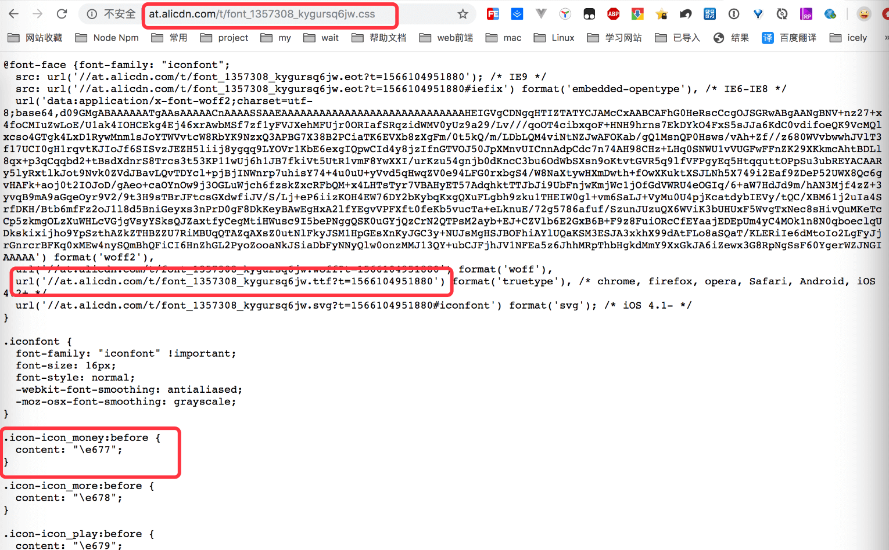

- Symbol
  - 该模式和上述二者有本质区别，Symbol 模式是通过 svg 技术来描绘图标，没有运用到 unicode 编码
  - 即通过不同的 svg 标签来描绘不同的图标。
  - 由于使用的是 svg 技术，属于图形，而不仅仅是字符。所以该模式支持彩色图标。
  - 通过阿里 iconfont 给出的 js 链接，在浏览器中直接查看该文件可以看到其定义
  
  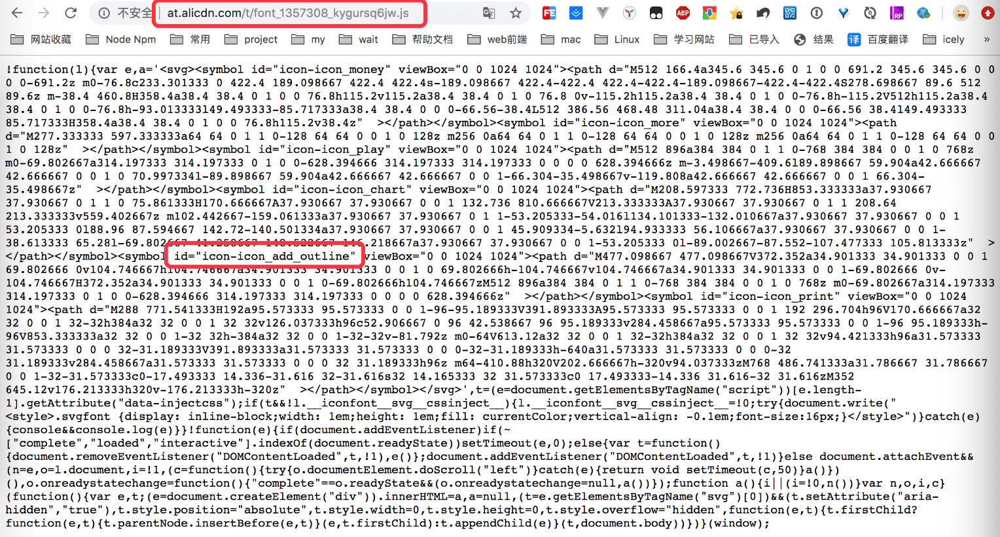


### 不同文件后缀的含义
- EOT（Embedded Open Type）是微软创造的字体格式。在 IE 系列的浏览器下使用。
- SVG（Scalable Vector Graphics (Font)）是一种用矢量图格式改进的字体格式。注意这里的 svg 与 symbol 的 svg 是两个概念。前者是 svg 类型的字体描述，后缀是直接描述svg 图形。该模式在 ios 移动端中才支持
- OTF（OpenType Font）和 TTF（TrueType Font）是 Apple 公司和 Microsoft 公司共同推出的字体文件格式,随着 windows 的流行,已经变成最常用的一种字体文件表示方式。目前主流浏览器都支持该模式。
- WOFF（Web Open Font Format），WOFF字体通常比其它字体加载的要快些，使用了 OTF 和 TTF 字体里的存储结构和压缩算法。目前主流浏览器都支持该模式
- 其具体兼容性情况，我们可以通过打开 iconfont 的 Font class 链接，通过备注信息得知。
   


## 工具代码讲解
- 工具 除了 vue 和 opentype.js，本工具仅由一个 html 文件完成。有兴趣的同学可以[点击这里](https://github.com/Momo707577045)查看源码。
- 工具的原理很简单，通过以下几个步骤实现
  - 获取字体定义文件。对于本地解析，通过input框获取本地文件。对于在线文件，则通过 ajax 获取字体定义文件。
  - 对于在线的 css 与 js 文件，通过正则匹配所有 icon 名称，并通过数组保存。对于 ttf 文件，则借助 [opentype.js](https://github.com/opentypejs/opentype.js) 进行解析。
  - 动态创建 dom，载入资源文件，并将采集到的所有 icon 遍历显示出来。
- 为什么本地文件只支持 ttf ？
  - 因为该文件类型的兼容性较好，在主流浏览器中均可使用。
  - 壁纸曾尝试过使用 svg 文件，但发现其在chrome中无法解析，后来才知道，该格式目前只在 ios 移动端使用
- 为什么需要借助 opentype.js 解析 ttf 文件
  - 因为 ttf 文件通过 big-endian 编码，使普通的方式无法进行编码转义。无法进行正则匹配。
  - 故借助外部 opentype.js 库进行图标解析。

## 讲完了，有空来[我的博客](http://blog.luckly-mjw.cn)坐坐呀!


